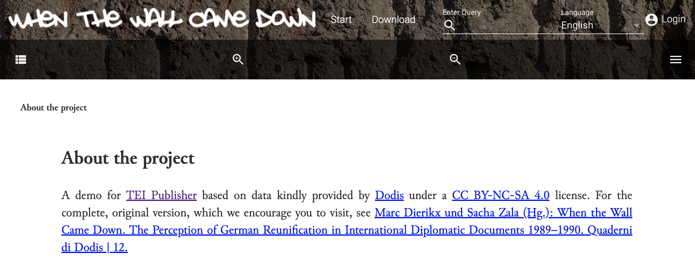
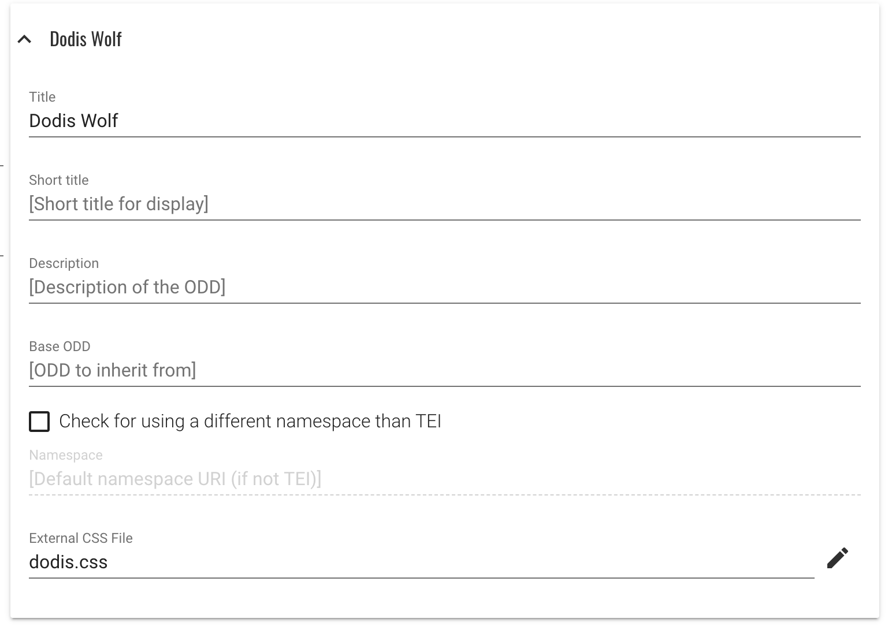
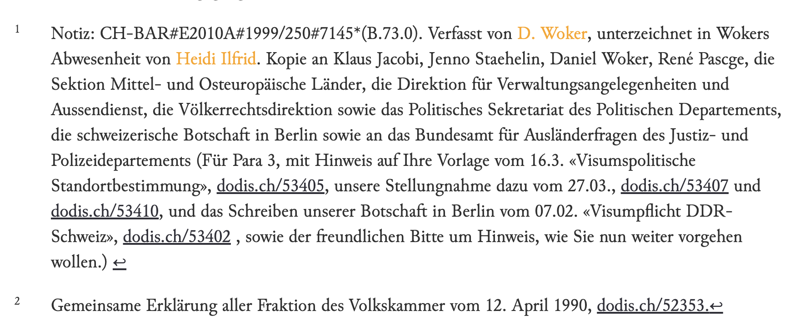
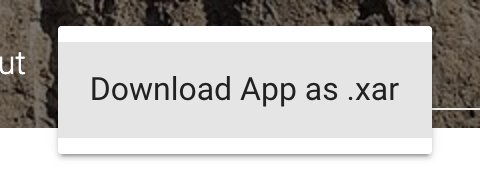

# Assignments for the third week

## 8. Generating a separate application

Last time we prepared a nice page template to display our Dodis texts, so we are ready to create a standalone application for Dodis material.

### 8.1 Generate the app

In TEI Publisher, choose **"Admin"/"App Generator"** from the menu and fill out the form. Note you need to be logged in for the "Admin" menu to be available.

* select your custom ODD in the ODD field
* when choosing the URL, use one which uniquely identifies your new application; it doesn't have to correspond to any existing domain
* short name will be used as the name of the collection to store your application in eXist-db; it cannot contain spaces or special characters
* title of the app doesn't impose such limitations, choose one you think is best for your app
* as HTML template, choose the one you prepared last week; if you don't have it ready, select *Shakespeare Play* template
* stick to suggested values for *Default View* and *Default Full Text Index* fields
* define a user name and assign a password for the user who will own the new app; make sure you remember what they are! For the sake of simplicity, you can also use the default user `tei-demo` with password `demo`.

Upon clicking Save/Generate your new app will be created and a link to open it presented to you in a dialog window.

You will note that the app doesn't contain any documents and otherwise looks very much like a clone of TEI Publisher.

Log in with the user you created for the app and upload Dodis documents using the Upload field.

Our next steps will demonstrate how to personalize the look and feel of a generated app.

### 8.2 Add custom styles file

Main *control room* for CSS styling of the TEI Publisher and generated apps are the styles defined in `resources/css/theme.css`. These styles control such display features as fonts, margins, colors etc. For the sake of modularity and ease of customization, many properties are defined in CSS variables which can be defined once and referenced in multiple places.

When customizing the styling of a generated app, you are encouraged not to modify `theme.css` directly but to create your own CSS theme file. This way, similarly like with ODD chaining, you can benefit from default Publisher styles, remain on the easy upgrade path and only selectively overwrite variables and styles which differ for your app.

Create your custom CSS file and store it in `resources/css`, e.g. as `dodis-theme.css`. To load these styles in your HTML template, you will need to add an extra line in your template.

After existing link to the `theme.css`

```html
<link rel="stylesheet" href="resources/css/theme.css" />
```

add another line linking to your custom CSS

```html
<link rel="stylesheet" href="resources/css/dodis-theme.css" />
```

and save the template file.


### 8.3 Change the logo

To add a custom feel to the app, we will need some graphic resources, like logo, backgrounds or other imagery. We have prepared these files for Dodis app and stored them in the `images` folder of this repository.

1. Upload the image files from `images/` to `/db/apps/dodis-your-name/resources/images` via eXide
2. Edit `/db/apps/dodis-your-name/index.html` and change the image URL for the logo to `resources/images/logo.png`
3. Reload the start page of your app

The logo is visible, but unpleasantly distorted:


To fix this, we need to change the CSS rule for the logo in our custom style file `resources/css/dodis-theme.css`.

```css
.logo img {
    width: auto;
    height: auto;
    background-size: 100% 100%;
    cursor: pointer;
}
```

And, obviously, link the custom style file, like we did for our custom template.

```html
<link rel="stylesheet" href="resources/css/dodis-theme.css" />
```


While we have successfully replaced the logo for the starting page, viewing a single document will still display the old one.

This happens because each of page templates available in Publisher for viewing documents is including (via eXist templating mechanism) the same menu section, stored in `templates/menu.html`. 

As an exercise, change the logo in that file as well, so that document view displays the new logo too.

### 8.4 Change header background image

As we discussed before, the layout of our document view is defined by the page template, which includes the menu and toolbar. This template uses webcomponent called `app-toolbar` for both menu and the toolbar below. Both are wrapped into `app-header` webcomponent.

```html
<app-header slot="header" fixed="fixed">
    <app-toolbar data-template="templates:include" data-template-path="templates/menu.html"/>
    <app-toolbar data-template="templates:include" data-template-path="templates/toolbar.html"/>
</app-header>
```

We'll need to analyze `theme.css` to find styling rules that govern the background color and image for the header.

Quick search for the `app-header` reveals this rule, pointing that the background image for the header is defined in the `--pb-header-background-image` CSS variable. Following that trail we'll notice that by default it is set to none.

```css
app-header {
    background-image: var(--pb-header-background-image);
}
```

We have already uploaded image files into `resources/images`, so we can just overwrite the variable in our `resources/css/dodis-theme.css`. Please that the paths need to be relative to the location of the CSS file.

```css
body {
    --pb-header-background-image: url(../images/bg-header.jpg);
}
```

You may try to refresh the page at this point but you will note that our changes seem to have no effect. Closer analysis of the applied styles show that both menu and toolbar have their background color properties defined (cf. styles for classes `.toolbar` and `.menubar`), which obscures any background images underneath. Default values for these colors are defined in `theme.css` as:

```css
body {
    --pb-menubar-background-color: #35424b;
    --pb-toolbar-background-color: #d1dae0;
}
```

We can overwrite these variables in our custom styles, setting both variables to `none`.


### 8.5 Darken the header background

Our intervention helped, but this background makes it very hard to notice the icons and labels. What could help would be to create a darker but semi-transparent color overlay on menu and toolbar. The original image will still shine through but will be toned down considerably.

As an exercise, adjust the `--pb-menubar-background-color` to black but half-transparent. Use CSS color specification using [rgba](https://www.w3schools.com/css/css3_colors.asp) values which allow specifying the alpha channel for opacity.

Treat the toolbar in a similar manner, but make it visibly darker than the menubar. 

Please note that default coloring of the toolbar labels is dark. You can reverse this via `--pb-toolbar-color` variable, setting it to the same value that `--pb-menubar-color` uses.

 Final effect should resemble the image below.


### 9. Add a static page

Most editions will include not only transcribed primary sources but also numerous static pages with project description and auxiliary resources. Let's add a static **About** page, which is itself written in TEI and therefore can be transformed in the same way as other TEI files in our application.

## 9.1 Add about page

1. Upload the `about.xml` file provided in the workshop material to your application's data directory. Using **Upload** field on the landing page is easiest but you can also use eXide.


2. Follow the link to display the document. It is a TEI encoded file so the text is displayed correctly. Unfortunately, default page template which includes facsimile viewer is unsuitable for this page. We can control it by adding a custom processing instruction to the *About* document.

3. Just add an instruction like below before your root TEI element. Use the name of your page template as the value of `template` attribute.

```xml
<?teipublisher template="dodis.html"?>
```

4. Save and reload the page, it should look like this



5. Add link to the menu on the landing page, editing the `index.html`

6. We would not like the *static* content to mix with our source documents. We can eliminate *About* page from the list of documents adding an exception to the list in `$config:data-exclude` of `modules/config.xml`

## 9.2 Adjust the menu for document view

As you probably expect, document view menu needs to be adjusted separately. Please do it as an exercise on your own.


## 9.3 Create another static page

As an exercise, create another static page on the subject of your choice, upload it, link from the menus and exclude from the document list.

## 10. Global document styles

As we said before, the ODD should be considered as a place to record editor's decisions about intended rendition of the source documents. E.g. choosing the style of brackets signalling conjectures or expansions, gaps, separators for textual apparatus entries etc. When publishing on the web, or producing a book, there are many more parameters influencing the final result: typography, colors, styles of popovers etc. The latter, while important, are usually not editorial aspects and should be specified in the external styles theme.

Knowing this, we should adjust our ODD rules for **persName**, in which we hardcoded the orange color. It would be better to assign persName a CSS class and define the styles in an external CSS stylesheet.

This will be a separate CSS stylesheet, which should not be confused with the custom `dodis-theme.css` we created in 8.2 above. `theme.css` and `dodis-theme.css` control the general look and feel of the application. Contrary to this, how the transformed text is displayed is determined by the ODD and - optionally - external styles associated with it.

### 10.1 Add cssClass for persName

1. Edit ODD and remove `outputRendition` for `persName`
2. Add `cssClass` for `persName`
3. In eXide create a new CSS file and add a rule for `.persName`:
   
   ```css
   .persName {
        color: dark-orange;
    }
    ```
4. Save the file to `/db/apps/dodis-your-name/resources/odd` using a file name ending in `.css`
5. In the ODD editor, add the newly created CSS file
   
6. Save the ODD
7. Reload the document. Final result should be the same (just using `dark-orange` instead of `orange` color).

Note that CSS files imported in this way are statically linked to the ODD. This means that whenever you change the CSS, you should also save or regenerate the ODD once!

### 10.2 Change general link colors

Our document contains various links, which are currently rendered in a blue default color. We may want those links to stand out less and remove the color. This is a perfect use case for a global document style.

We can overwrite the general CSS for HTML links by targetting all HTML `<a>` elements. In the newly created CSS file, add a rule for `a`:

```css
a {
    your custom CSS here
}
```

You can read everything about link styling in [this article](https://css-tricks.com/css-basics-styling-links-like-boss/).

Don't forget that you need to save the ODD even if you just changed the CSS!



## 11. Download the application to local disk

Use the **"Admin"/"Download App ..."** button to save your entire application: data, ODD, XQuery modules, styles etc as a *xar* package to disk. 

You can then distribute this file so it can be installed on any other eXist instance.



If you would like to upload the generated application to github or gitlab, create a directory and unzip the `.xar` into it. Next you can commit/push the created directory into a repository of your choice.

If you make local changes, you can always rebuild a fresh `.xar` by calling the included build script in `build.xml`. To do so, you need a Java-based build tool called [ant](https://ant.apache.org/). This is available for most platforms. Once you installed ant, just call

```
ant
```

on the command line inside your app directory and you should get a fresh `.xar` generated into the `build` subdirectory.